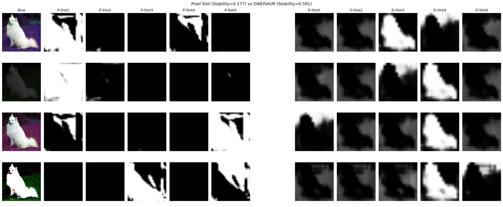

# Object-Centric Representation Learning with Pre-trained Features

[](https://www.python.org/downloads/)
[](https://pytorch.org/)
[](https://opensource.org/licenses/MIT)

## 研究課題名 / Research Title

**物体中心表現学習における事前学習特徴の有効性検証：ピクセルベース vs 特徴ベースSlot Attentionの比較**

*Effectiveness of Pre-trained Features in Object-Centric Learning: A Comparison of Pixel-based and Feature-based Slot Attention*

## 概要 / Abstract

### 日本語（400-500字）

物体中心表現学習は、画像や動画に映る物体を個別のスロットとして表現する枠組みである。Slot Attentionは教師なしで物体を分離できる手法として注目されているが、ピクセル再構成ベースの学習では色や照明の変化に敏感であり、形状情報の抽出が困難であることが知られている。本研究では、この問題に対してDINOv2などの事前学習済み視覚特徴を活用するDINOSAURアプローチの有効性を検証する。具体的には、同一の犬画像に対して色相・明度・コントラストを変化させたテストセットを用意し、ピクセルベースSlot AttentionとDINOSAUR（特徴ベース）のマスク安定性を定量的に比較した。評価指標として、色変化間でのマスクのコサイン類似度（Mask Stability）およびスロット間の多様性（Slot Diversity）を導入した。実験の結果、DINOSAURはMask Stabilityにおいて3.3倍の改善（0.59 vs 0.18）を示し、色変化に対して一貫したマスクを生成することを確認した。一方、Sマスクの境界鮮明度（Sharpness）ではピクセルベースが高く、特徴ベースはソフトな境界を生成する傾向があることを発見した。

### English (200-300 words)

Object-centric representation learning aims to decompose visual scenes into individual object representations called slots. While Slot Attention has emerged as a promising unsupervised approach for object discovery, pixel-based reconstruction objectives are known to be sensitive to color and lighting variations, making it difficult to extract shape-based features. This study investigates the effectiveness of leveraging pre-trained visual features from DINOv2, following the DINOSAUR approach. We conducted a controlled comparison between pixel-based Slot Attention and feature-based DINOSAUR using a test set with systematic color transformations including hue shifts, brightness changes, and contrast adjustments. We introduced quantitative evaluation metrics: Mask Stability (cosine similarity of masks across color variations) and Slot Diversity (separation between different slots). Our experiments demonstrate that DINOSAUR achieves 3.3× improvement in Mask Stability (0.59 vs 0.18), producing consistent masks regardless of color transformations. However, we also discovered a trade-off: pixel-based approaches exhibit sharper mask boundaries, whereas feature-based methods tend to generate softer boundaries. These findings provide quantitative evidence for the benefits and limitations of pre-trained features in object-centric learning.

## リサーチギャップ / Research Gap

### 日本語
ピクセル再構成ベースのSlot Attentionは色変化に対して脆弱であることが経験的に知られているが、事前学習特徴を用いた場合の定量的な改善度合いは十分に検証されていない。

### English
While pixel-based Slot Attention is known to be sensitive to color variations, the quantitative improvement achieved by using pre-trained features has not been systematically evaluated under controlled conditions.

## 主要な結果 / Key Results

| Metric | Pixel Slot | DINOSAUR | Interpretation |
|--------|-----------|----------|----------------|
| Mask Stability (↑) | 0.177 | **0.591** | DINOSAUR is 3.3× more robust to color |
| Slot Diversity (↓) | **0.236** | 0.407 | Pixel produces sharper masks |



## プロジェクト構成 / Project Structure

```
.
├── README.md                    # このファイル
├── docs/
│   ├── RESEARCH_LOG.md          # 研究活動記録
│   ├── METHODS.md               # 手法の詳細説明
│   └── figures/                 # 図表
├── src/
│   ├── ex_slot1.ipynb ~ ex_slot5.ipynb    # ピクセルベース実験
│   ├── ex_dino1.ipynb ~ ex_dino4.ipynb    # DINOSAUR実験
│   └── ex_comparison.ipynb                 # 同条件比較実験（最終）
├── requirements.txt             # 依存パッケージ
├── pyproject.toml               # プロジェクト設定
└── LICENSE                      # ライセンス
```

## セットアップ / Setup

```bash
# リポジトリのクローン
git clone https://github.com/YOUR_USERNAME/object-centric-learning.git
cd object-centric-learning

# 仮想環境の作成と有効化
python -m venv .venv
source .venv/bin/activate  # Linux/Mac
# .venv\Scripts\activate   # Windows

# 依存パッケージのインストール
pip install -r requirements.txt
```

## 実行方法 / How to Run

### 比較実験（推奨）
```bash
jupyter notebook src/ex_comparison.ipynb
```

### 個別実験
```bash
# ピクセルベースSlot Attention
jupyter notebook src/ex_slot5.ipynb

# DINOSAUR (DINOv2 Feature-based)
jupyter notebook src/ex_dino4.ipynb
```

## 参考文献 / References

1. Locatello, F., et al. (2020). "Object-Centric Learning with Slot Attention." *NeurIPS 2020*.
2. Seitzer, M., et al. (2023). "Bridging the Gap to Real-World Object-Centric Learning." *ICLR 2023*. (DINOSAUR)
3. Oquab, M., et al. (2024). "DINOv2: Learning Robust Visual Features without Supervision." *TMLR 2024*.

## ライセンス / License

MIT License - 詳細は [LICENSE](LICENSE) を参照

## 著者 / Author

- [Your Name] - [Your Institution]

---

*This project is part of [Course/Program Name] research activities.*
